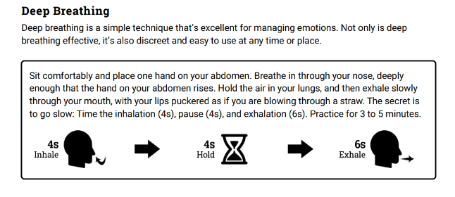

# Reflection
* How did you put yourself first today? What did you do well?
* How do you notice you're feeling tired? How did you respond? 
* How can you ask for support? 
* Where/ When/ How can you advocate for yourself?
* What do you need to recharge?

<input type="text" id="name" name="name"/>

[self- assessment](https://www.mindtools.com/pages/article/newTCS_08.htm)

# Nurse Fatigue 
* Nurse fatigue is defined as: “A subjective feeling of tiredness (experienced by nurses) that is physically and mentally penetrative. It ranges from tiredness to exhaustion, creating an unrelenting overall condition that interferes with individuals’ physical and cognitive ability to function to their normal capacity. It is multidimensional in both its causes and manifestations; it is influenced by many factors: physiological (e.g., circadian rhythms), psychological (e.g., stress, alertness, sleepiness), behavioral (e.g., pattern of work, sleep habits) and environmental (e.g., work demand). Its experience involves some combination of features: physical (e.g., sleepiness) and psychological (e.g., compassion fatigue, emotional exhaustion). It may significantly interfere with functioning and may persist despite periods of rest” (Canadian Nurses Association [CNA] & Registered Nurses’ Association of Ontario [RNAO], 2010, p.12)”
* Fatigue affects all nurses regardless of where they work.
* Fatigue affects all nurses regardless of where they work.
  * 55.5% of nurses always or almost always feel fatigued at work 
  *80% of nurses feel fatigue after work
  *67.6% of nurses reported experiencing the effects of sleep deprivation
  *26% of nurses who are considering leaving their profession have fatigue as a contributing factor
* Heavy workloads, staffing shortages, shift work, increased patient acuity, increased patient expectations, decreased time for professional development, decline in leadership, and inadequate recovery time and personal factors are cause of nursing fatigue
  * Health care cultures such as “hero” culture and nursing ideology of “doing more with less” creates pressure for nurses to take on extra work is a cause for nurse fatigue
  (CNA, 2012)
  
## Signs and Symptoms 

Physical: 
* yawning, heavy eyelids, eye rubbing, head dropping, inappropriate sleep onset, decreased hand eye coordination

Mental:
* increased anxiety, slowed reaction time, decreased efficiency and performance, difficulty concentrating, lapses in attention, difficulty with memory, failure to communicate appropriately, failure to anticipate, errors of commission, errors of omission

Emotional: 
* feeling totally isolated, feeling worn out, being more quiet and/or withdrawn than normal, feeling lethargic, lacking motivation, feeling irritable or exhibiting tempered behavior

# Sleep
Individual recommendations by the CNA emphasis a need to engage in appropriate self- care. 

## Deep breathing 
Evidence shows that slow-paced breathing or abdominal breathing can act as a non- pharmacological intervention for insomnia. The exercise acts to increase vagal tone to decrease the heart rate, improve sleep onset and sleep quality. (Tsai et al., 2015)

## Stimulants 
* Avoid stimulants(Exercise and caffeine) 4 hours before bed
  * Caffeine avoidance includes chocolates and OTC medications that caffeine. (HHS, 2005) 
  * Exercise during the day can promote sleep 
  * Television, phones and alarm clocks also act as stimulating activities 
* Alcohol use leads to interrupted sleep

* The use of sedatives such as Melatonin can be used 30-60 mins before bed to promote sleepiness in response to shift change (HHS, 2013)

## Train your brain
* Only use your bed for sleep and sex
* Dress/ undress for comfort 
* reduce light and noise
  * Use blackout curtains 
  * TV and music may be detrimental, but white noise such as a fan or air conditioner may help you sleep

* Using repetitive thoughts can help prevent other thoughts from entering your head and help you sleep. (HHS, 2005)

* If you are still awake in 30 mins, leave bed and do a relaxing activity and try again. Staying in bed will lead to frustration and make it harder to sleep.

### Positioning

### Worry journal - combating negative thoughts
* Having a notepad by your bed to write down anything that needs to be done in the morning or anything you're worried about can help you fall asleep! (Friedrich & Schlarb, 2018; Scullin et al., 2018)

* Worries related to work, school and relationships activate your fight or flight and looks a little something like this: 

* Identifying these thoughts can help you deal with them. 

* What is your evidence for your negative thought?
* Is there evidence for an alternative more neutral thought?
* If your worry does come to light, how can you handle it? and will you eventually be ok?

* End your problem- solving session by listing some positive things that have happened recently! or list a few things you like about yourself, or god things to come in the future.  
(Luo et al., 2019)

* Exploring and finding solutions are best done in conjunction with a relaxing follow up!
(Friedrich & Schlarb, 2018)

### Guided Imagry and Muscle Relaxation

## CBT 
[What is CBT?](https://www.camh.ca/en/health-info/mental-illness-and-addiction-index/cognitive-behavioural-therapy)

Is proven to be an effective treatment for sleep disorders like insomnia but it involves homework!
(Public Health England, 2017)
* both in person and online therapy has been proven beneficial 

[Free year-long CBT program with OntarioShores](http://www.eknplc.ca/2018/12/depressed-anxious-year-long-cbt-program-is-free/)

[Community mental health resources in Ontrio](http://www.centrallhin.on.ca/en/ForHSPs/CovidResources.aspx)

[Online CBT with self- directed modules and therapy check-ins](https://myicbt.com/home?gclid=Cj0KCQiAyJOBBhDCARIsAJG2h5fDyL5m4uLvOAePvW_-6HZilI0OQExpoKRjqbxPiwVs2-tTjFhJcf0aApIVEALw_wcB)

# During your shift
Sometimes you recognize you're tired during your shift, what can you do to help yourself? 

Using cold water, fresh air or getting some bright lights/ sunlight exposure may help you feel more awake and vigilant. 

Try your best to sty hydrated and get a bite to eat.

(Penn & Bootzin, 1990)

[CNA recommended article- Shift Work: Solutions for sleep problems](https://health.cvs.com/GetContent.aspx?token=f75979d3-9c7c-4b16-af56-3e122a3f19e3&chunkiid=21257)

# References 

